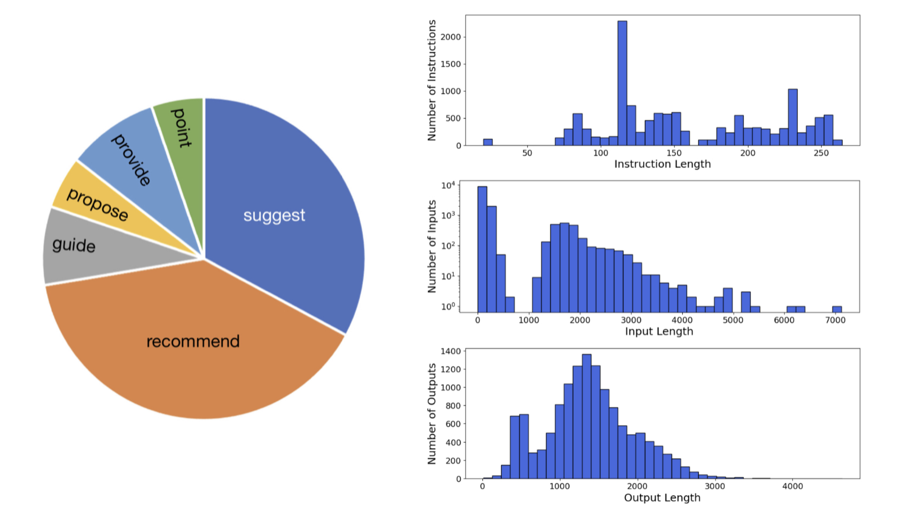
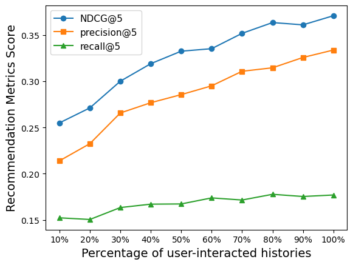

# Beyond GPT-3.5 in Conversational Recommendation Systems: Introducing RecAlpaca, a Fine-tuned Model based on Alpaca-7B

<br />

This is the project code which aim to build a dedicated instruction following dataset that not only facilitates the fine-tuning of a language model for explainable recommendations but also a strong recommendation capabilities.

This repo contains:
- The code to [`generate the data.`](./dataGeneration/)
- The code to [`fine-tuning Alpaca-7B.`](./alpacaLoraTrain.py)
- The code to [`evaluate Alpaca-7B.`](./evaluation_test.py)
- The code of our [`evaluation results.`](./testEvalTop1.ipynb)

## Overview

The RecAlpaca model is a result of fine-tuning a 7B Alpaca model [1] using a dataset consisting of 13k examples of instruction recommendations. These recommendations were generated following the approach described in a research paper referred to as Self-Instruct [2]. The weights of RecAlpaca can be found in HuggingFace Hub with [model card](https://huggingface.co/Allenpai/AlpacaLoraRec).

[1]: Alpaca: Stanford Alpaca: An Instruction-following LLaMA model. Rohan Taori and Ishaan Gulrajani and Tianyi Zhang and Yann Dubois and Xuechen Li and Carlos Guestrin and Percy Liang and Tatsunori B. Hashimoto. https://github.com/tatsu-lab/stanford_alpaca

[2]: Self-Instruct: Aligning Language Model with Self Generated Instructions. Yizhong Wang, Yeganeh Kordi, Swaroop Mishra, Alisa Liu, Noah A. Smith, Daniel Khashabi, Hannaneh Hajishirzi. https://arxiv.org/abs/2212.10560

## Data Release

The file [`rec_combined_data.json`](./trainingSet/rec_combined_data.json) is a dataset containing 13k instances of instruction-following data used for fine-tuning the RecAlpaca model. This JSON file is structured as a list of dictionaries, where each dictionary contains the following information:


The file [`rec_combined_data.json`](./trainingSet/rec_combined_data.json) is a dataset containing 13k instances of instruction-following data used for fine-tuning the RecAlpaca model. This JSON file is structured as a list of dictionaries, where each dictionary contains the following information:

- `instruction`: A string describing the recommendation tasks and their respective domains.
- `input`: A string representing the input, which can either be the highly rated items of the user or a combination of the user's profile and items they like & dislike.
- `output`: A string indicating the generated recommendation items and the reasons for those recommendations. This output is generated using the `gpt3.5-turbo`.

The file [`ML100kEvaluationRecAlpaca.json`](./testSet/ML100kEvaluationRecAlpaca.json) serves as a test set and includes 200 samples that have been randomly selected from the [MovieLens-100k](https://grouplens.org/datasets/movielens/100k/) Dataset. These samples are structured similarly to what was previously described. However, they contain additional information:

- `testGT`: testset ground truth which comprises a randomly selected 20% of movies that the user truly enjoyed and preferred.
- `output`: consists of the recommendation results produced by the RecAlpaca model, excluding the top1 recommended movie in the input prompt.
- `wTop1Input`: contains input prompts alongside the top1 recommended movie.
-  `output2`:  holds the recommendation outcomes from the RecAlpaca model, including the top1 recommended movie from the input prompts.

## Data Generation Notes

- We used `gpt3.5-turbo` to generate the instruction data instead of `text-davinci-003` primarily to keep costs lower.

- We take each user's infomration on real datasets [MovieLens](https://grouplens.org/datasets/movielens/), [Book-Crossing](http://www2.informatik.uni-freiburg.de/~cziegler/BX/) and [Anime](https://www.kaggle.com/datasets/CooperUnion/anime-recommendations-database) to generate our input prompts. 

- We utilized the `gpt3.5-turbo` model to generate output prompts, which encompass recommendation explanations and item descriptions. This was achieved by supplying the test set as a prompt, ensuring that the GPT model's responses are not generated randomly but aligned with the input context.

- In order to teach RecAlpaca to understand user preferences and profiles, as well as select the most relevant items from the candidate set, we employed two lightGCN networks. These networks were trained using [MovieLens-1m](https://grouplens.org/datasets/movielens/1m/) and [MovieLens-100k datasets](https://grouplens.org/datasets/movielens/100k/), leading to the generation of candidate sets and the top1 recommendation for each user. This process in turn produced more comprehensive instruction datasets with detailed information.

The statistical information of our dataset can be find in following figures:

  

where the left pie chat illustrates the 6 most verbs found in the generated instructions. On the right, sub-figures depict the distributions of generated instructions, their correspoding inputs, and outputs.

<p>&nbsp;</p> 

## Experiments Environments
 - OS: Intel(R) Core(TM) i5-8259U@230 GHz Macbook pro 2020
 - GPU:NVIDIA GeForce RTX 3090 with 24GB RAM

## Install requirements
 - ```pip install -r requirements.txt```

## Fine-tuned
We perform the fine-tuning process for our models using the standard training code provided by Hugging Face. During this process, the model is optimized exclusively based on the output generations it produces.

For the fine-tuning of the Alpaca-7B model, we utilize the following set of hyperparameters:

| Hyperparameter | Alpaca-7B | 
|----------------|----------|
| Batch size     | 32     | 
| Learning rate  | 1e-4     |
| Epochs         | 3        | 
| Micro Batch Size    | 8     | 
| Lora r  | 16     | 
| Lora alpha | 16     | 
| Lora dropout | 0.05  |
 | Lora Target Modules | [q_proj, k_proj, v_proj, o_proj]  |

 ## Results: RecAlpaca vs GPT3.5, LightGCN and LightFM
 
In comparing our approach with other methods, we have considered classical recommendation models and the [CHAT-REC](https://arxiv.org/abs/2303.14524) model proposed by Gao et al. Our evaluation involves the RecAlpaca model with top $5$ recommendations. It is evident from the results that RecAlpaca outperforms all classical recommendation systems as well as [CHAT-REC (gpt-3.5-turbo)](https://arxiv.org/abs/2303.14524). While the NDCG score is slightly lower than that of [CHAT-REC (text-davinci-003)](https://arxiv.org/abs/2303.14524), the precision and recall metrics of RecAlpaca exhibit notable improvements, specifically a precision increase of approximately 2.994% and a recall increase of approximately 26.068%.

| Models | precision@5 | recall@5 | NDCG@5 |
|----------------|----------|-----------|-----------| 
| LightFM    | 0.2823      | 0.1410 | 0.2846 |
| LightGCN  | 0.3030 | 0.1455 | 0.3425 |
| CHAT-REC(gpt3.5-turbo) | 0.3103| 0.1279 | 0.3696 |
| CHAT-REC(text-davinci-003) | 0.3240     | 0.1404 | **0.3802**|
| CHAT-REC(text-davinci-002) | 0.3031  | 0.1204 |0.3692|
| RecAlpaca | **0.3337**        | **0.1770**         |0.3708|

## Analysis 1: Prompts Analysis

With this experiments, our objective was to decrease the sizes of input prompts through the random drop user-interactd items and candidate set. We conducted tests ranging from retaining only 10% of these items up to 100%. The reuslts is illustrated as below:

  

the figure shows that as we progressively reduce the inclusion of user-intercated item histories, we observed a corresponding decrese in the information avaliable about the user. This led to a less clear understanding of the user's preferences, subsequently exerting a notable impact on the recommendation abilities, by evaluated on top 5 NDCG, precision, and recall scores.


## Analysis 2: RecAlpaca vs Alpaca-7B

### On recommendation task:

In the context of the recommendation task, the input prompts encompass details about user profiles, movies that are highly preferred by the user, movies that have lower preference, candidate set generate from a classical recommendation system (lightGCN) and the outcome of the top1 recommended choice.

  

 Figure above illustrates a comparsion between generation outputs from the test set using Alpaca and RecAlpaca. The difference are notable: without any fine-tuning, the Alpaca model tends to prioritize recommendations that fill the first four positions of the candidate set. This happens without accounting for the user's profile or preferences, and without providing any explanation for the recommendations.

 In contrast, RecAlpaca enhances its recommendations by incorporating comprehensive movie details and explaining the reasons behind each recommendation. It achieves this by taking into consideration the user's specific details and preferences during the recommendation process.

### On general query:

When it comes to queries involving suggestions or recommendations, the RecAlpaca model has a tendency to offer outputs that are more comprehensible and well-structured. An example illustrating this can be seen in the figure provided below:

  


 ## Train you own model
Ensure the dataset is in the correct Instruction-tuning format and make sure the `data_path` parameter in `alpacaLoraTrain.py` are correct, run ```python alpacaLoraTrain.py``` and if you would like to change your own model hyperpareters please refer to the `alpacaLoraTrain.py` and change respectively.
